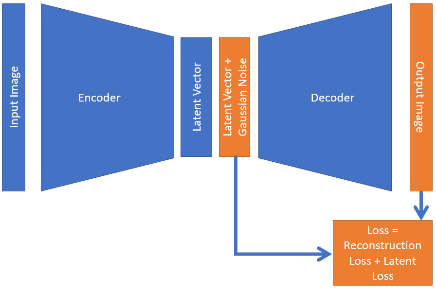
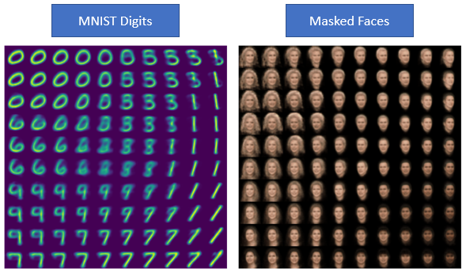

# SimpleVAE - Simple Way to Generate Smooth Latent Space (Tensorflow-Keras)

This repository provides implementation simplified Variational Autoencoder (VAE), producing smooth latent space completely unsupervised manner. And this can be used as generative model as well.

### Introduction

Variational Autoencoders (VAEs) are family of deep learning based generative models. VAEs are basically auto-encoders (encoder-decoder architecture). Encoding part of the VAE maps input to a latent variable and decoding part of the network map latent variable to input again reconstructing the input images. The unique thing in VAE is in the latent space. VAEs use sophisticated mathematical tricks to transform latent space into a Gaussian distribution. Two of those main mathematical tricks in VAEs are KL divergence (Kullback–Leibler divergence) transforming latent space into a Gaussian distribution, and sampling trick to simulate fully differentiable sampling method.

Alternatively to conventional VAE, in SimpleVAE, we simply add Gaussian noise to latent variable and add additional simple latent loss component forcing latent space to distribute around origin. These simple 2 tricks allow generating smooth latent space, allowing us to successfully generate images from the smoothed latent space without complicated mathematical tricks as in in VAEs.

Schematic presentation of this idea is shown in following figure,

<p align="center">

</p>

And examples of smoothed latent spaces produced in this repository from MNIST digits and masked faces with SimpleVAE are shown in following figures,

<p align="center">

</p>

### Libraries used

* numpy
* matplotlib
* tensorflow v1.12.0 
* keras

### Content

All codes are in *code* folder, and data are in *code/data* folder. Following 2 notebooks are in *code* folder,

* __SimpleVAE_MNIST__: SimpleVAE implemented on MNIST Dataset
* __SimpleVAE_Faces__: SimpleVAE implemented on Face Dataset

### Citation

Use this to cite this GitHub repository.

```
@misc{SimpleVAE,
  title={SimpleVAE - Simple Way to Generate Smooth Latent Space (Tensorflow-Keras)},
  author={N. Lakmal Deshapriya},
  year={2020},
  publisher={Github},
  journal={GitHub repository},
  howpublished={\url{https://github.com/lakmalnd/SimpleVAE}},
}
```

### References

* __Nice Explanation to VAEs in YouTube:__ Variational Autoencoders - EXPLAINED!. URL: https://www.youtube.com/watch?v=fcvYpzHmhvA
* __Nice Tensorflow-Keras VAE implementation:__ How to create a variational autoencoder with Keras?. URL: https://www.machinecurve.com/index.php/2019/12/30/how-to-create-a-variational-autoencoder-with-keras/
* __Face Dataset:__ Kae, A., Sohn, K., Lee, H., Learned-Miller, E.: Augmenting CRFs with Boltzmann Machine Shape priors for image labeling. In: IEEE Conference on Computer Vision and Pattern Recognition (CVPR). (2013)
* __MNIST Dataset:__ Y. LeCun, L. Bottou, Y. Bengio, and P. Haffner. "Gradient-based learning applied to document recognition." Proceedings of the IEEE, 86(11):2278-2324, November 1998.
